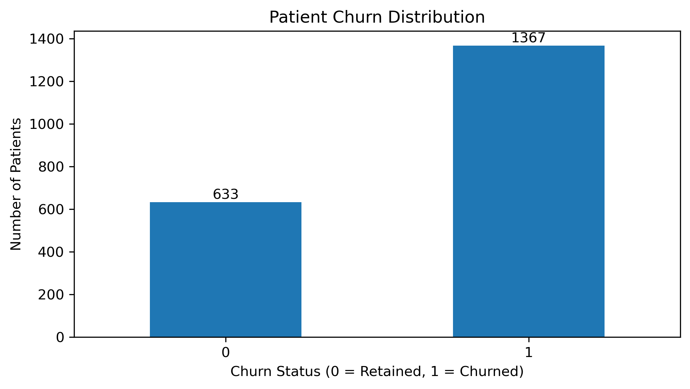
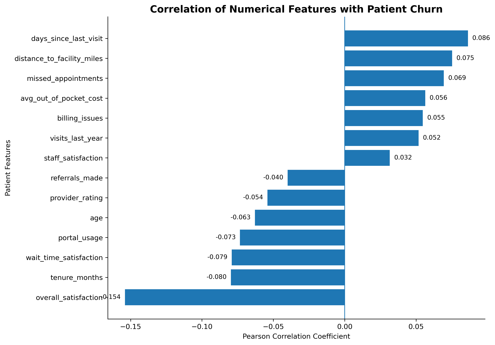
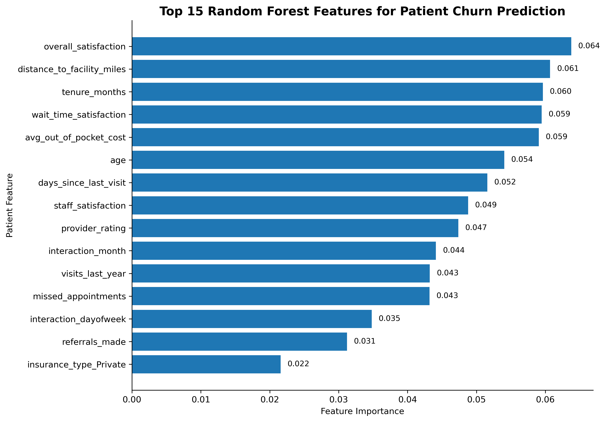

# Patient Churn Prediction Using Machine Learning

## Overview

Patient churn can reduce continuity of care, weaken patient-provider relationships, and create operational and financial challenges for healthcare organizations.

This project develops an end-to-end machine learning workflow to identify patients at risk of churn and investigate the patient characteristics most associated with disengagement. The analysis combines exploratory data analysis, statistical testing, feature engineering, class-imbalance handling, cross-validation, model comparison, and model interpretation.

## Business Problem

Healthcare organizations benefit from identifying patients who may disengage before churn occurs. A reliable churn-risk model can support targeted retention strategies, improve continuity of care, and help organizations focus outreach resources on patients who may need additional support.

The goal of this project is not only to predict churn, but also to understand the factors associated with it and translate those findings into actionable business insights.

## Project Objectives

- Audit and prepare the patient churn dataset.
- Explore churn patterns using descriptive and inferential statistics.
- Identify statistically meaningful patient-level factors associated with churn.
- Evaluate relationships among numerical variables using correlation analysis.
- Build and compare multiple classification algorithms.
- Address class imbalance using SMOTE inside the machine-learning pipeline.
- Evaluate the selected model on an untouched test set.
- Interpret Random Forest feature importance and compare it with EDA findings.
- Translate analytical findings into patient-retention recommendations.

## Dataset

The analysis uses a patient churn dataset from Kaggle containing **2,000 patient records and 21 variables**.

The target variable is:

- `churned = 0` — Retained patient
- `churned = 1` — Churned patient

Target distribution:

- Retained: **633 patients (31.65%)**
- Churned: **1,367 patients (68.35%)**

<p align="center">
  
</p>

The target distribution shows a clear class imbalance, with **68.35% of patients classified as churned** compared with **31.65% retained**. This imbalance motivated the use of SMOTE within the machine-learning pipeline while preserving the untouched test set for final evaluation.

> Dataset source: [patient-churn-prediction-dataset-for-healthcare](https://www.kaggle.com/datasets/nudratabbas/patient-churn-prediction-dataset-for-healthcare)
## Analytical Workflow

### 1. Data Quality Assessment
The dataset is inspected for:

- Data types
- Missing values
- Duplicate records
- Distribution of the target variable
- Potential outliers

### 2. Exploratory Data Analysis

The analysis investigates distributions and patterns across numerical and categorical patient characteristics.

Statistical techniques include:

- Welch's independent-samples t-test
- Chi-square tests of independence
- Pearson correlation analysis

The EDA suggests that patient churn is more strongly associated with patient experience, engagement, utilization, accessibility, and financial characteristics than with broad demographic categories.

#### Correlation with Patient Churn

<p align="center">
  
</p>

The correlation analysis indicates that no single numerical feature has a strong linear relationship with patient churn. Instead, churn appears to reflect the combined influence of multiple patient characteristics. This supports the use of multivariable machine-learning models capable of evaluating several predictors simultaneously.

### 3. Feature Engineering

The workflow:

- Removes the patient identifier from predictive features.
- Converts the interaction date into model-ready temporal features.
- Standardizes numerical variables.
- One-hot encodes categorical variables.
- Uses SMOTE inside the model pipeline to reduce leakage risk.

### 4. Machine Learning Models

Five classification algorithms are evaluated using **5-fold stratified cross-validation**:

1. Logistic Regression
2. Decision Tree
3. Random Forest
4. K-Nearest Neighbors
5. XGBoost

## Model Comparison

| Model | Accuracy | Precision | Sensitivity | F1 Score | ROC AUC |
|---|---:|---:|---:|---:|---:|
| Random Forest | 0.661 | 0.695 | 0.900 | **0.784** | 0.600 |
| XGBoost | 0.631 | 0.701 | 0.802 | 0.748 | 0.567 |
| Logistic Regression | 0.604 | **0.763** | 0.615 | 0.680 | **0.632** |
| Decision Tree | 0.554 | 0.686 | 0.643 | 0.663 | 0.503 |
| KNN | 0.477 | 0.711 | 0.396 | 0.508 | 0.531 |

Random Forest was selected because it achieved the strongest F1 score and high sensitivity during cross-validation.

## Final Random Forest Performance

On the untouched test set, the selected Random Forest produced approximately:

| Metric | Score |
|---|---:|
| Accuracy | 0.662 |
| Precision | 0.684 |
| Sensitivity / Recall | **0.938** |
| Specificity | **0.071** |
| F1 Score | **0.791** |
| ROC AUC | 0.579 |

The model successfully identifies most churned patients, but its low specificity indicates a high false-positive rate. For that reason, the current model is best viewed as a **high-recall churn-screening model**, not a production-ready autonomous decision system.

## Random Forest Feature Importance

The most influential Random Forest features include:

| Rank | Feature | Importance |
|---:|---|---:|
| 1 | Overall satisfaction | 0.0638 |
| 2 | Distance to facility | 0.0607 |
| 3 | Tenure | 0.0596 |
| 4 | Wait-time satisfaction | 0.0595 |
| 5 | Average out-of-pocket cost | 0.0591 |
| 6 | Age | 0.0540 |
| 7 | Days since last visit | 0.0516 |
| 8 | Staff satisfaction | 0.0488 |
| 9 | Provider rating | 0.0474 |
| 10 | Interaction month | 0.0441 |


### Top Predictive Features

<p align="center">
  
</p>

The Random Forest analysis highlights overall satisfaction, distance to the facility, tenure, wait-time satisfaction, average out-of-pocket cost, age, and days since the last visit among the most influential predictors of churn.

Several of these variables were also identified during exploratory and statistical analysis. This overlap strengthens the evidence that patient experience, access, recency of care, and financial factors provide meaningful information for identifying patients at risk of churn.

 Random Forest feature importance measures a variable's contribution to prediction within the fitted model. It should not be interpreted as statistical significance or evidence of causality.


## Business Insights

The analysis suggests several retention opportunities:

- Prioritize low-satisfaction patients: Overall satisfaction produced the strongest univariate statistical signal and ranked highly in the Random Forest.
- Re-engage inactive patients: Longer time since the last visit was associated with churn.
- Improve the waiting experience: Wait-time satisfaction contributes both statistical and predictive information.
- Monitor missed appointments: Missed visits can support early-warning segmentation.
- Investigate access barriers: Distance to the facility may indicate practical barriers to continued care.
- Assess financial friction: Out-of-pocket cost contributes predictive information.
- Use engagement signals: Portal usage and interaction characteristics may help identify disengagement patterns.

These findings are observational and should be treated as hypotheses for operational testing rather than causal conclusions.

## Repository Structure

```text
patient-churn-prediction-ml/
│
├── README.md
├── requirements.txt
├── .gitignore
│
├── notebooks/
│   └── patient_churn_machine_learning.ipynb
│
├── data/
│   └── README.md
│
├── images/
│   └── .gitkeep
│
└── reports/
    └── patient_churn_machine_learning.html
```

## How to Run the Project

1. Clone the repository:

```bash
git clone YOUR_REPOSITORY_URL
cd patient-churn-prediction-ml
```

2. Create and activate a virtual environment.

Windows:

```bash
python -m venv .venv
.venv\Scripts\activate
```

macOS/Linux:

```bash
python3 -m venv .venv
source .venv/bin/activate
```

3. Install dependencies:

```bash
pip install -r requirements.txt
```

4. Place the dataset in the `data/` directory, if its license allows local redistribution.

5. Update the notebook's dataset path if necessary and run:

```bash
jupyter notebook
```

## Limitations and Future Improvements

Future improvements include:

- Random Forest and XGBoost hyperparameter tuning
- Classification-threshold optimization
- Precision-Recall AUC evaluation
- Probability calibration
- Permutation importance or SHAP explainability
- Class weighting as an alternative to SMOTE
- Temporal validation
- Fairness diagnostics
- Reusable inference pipeline or API deployment

## Key Takeaway

This project demonstrates an end-to-end machine-learning workflow while emphasizing an important practical lesson: the strongest model is not determined by one metric alone.

Random Forest achieved strong churn sensitivity and F1 performance, but its weak specificity highlights the need to evaluate predictive models according to the real-world costs of false positives and false negatives.

## Author

**Baba Sirima**  
Data Science | Machine Learning | Predictive Analytics

## Skills Demonstrated

This project demonstrates an end-to-end data science workflow, from exploratory analysis and statistical testing to machine learning, model evaluation, interpretation, and business recommendations.

- **Exploratory Data Analysis (EDA):** Investigated patient characteristics, churn distribution, numerical relationships, and potential churn drivers.
- **Data Preprocessing & Feature Engineering:** Prepared numerical and categorical variables, engineered date-based features, and constructed reproducible preprocessing pipelines.
- **Statistical Analysis:** Applied independent-sample t-tests and correlation analysis to identify variables associated with patient churn.
- **Imbalanced Classification:** Addressed class imbalance using SMOTE within the training pipeline while keeping evaluation data untouched.
- **Machine Learning:** Developed and compared Logistic Regression, Decision Tree, Random Forest, K-Nearest Neighbors (KNN), and XGBoost classifiers.
- **Model Validation:** Used stratified train/test splitting and 5-fold cross-validation to evaluate model generalization.
- **Model Evaluation:** Compared models using Accuracy, Precision, Sensitivity (Recall), Specificity, F1 Score, and ROC AUC.
- **Model Interpretation:** Analyzed Random Forest feature importance to identify influential predictors of patient churn.
- **Business Analytics:** Translated statistical and machine-learning results into actionable patient-retention insights.
- **Reproducible Data Science:** Organized the analysis using Python pipelines, structured notebook sections, reusable code, and GitHub documentation.


## Technical Skills & Tools


 _**Programming**: Python. 
 _**Data Manipulation**: Pandas, NumPy. 
 _**Data Visualization**: Matplotlib. 
 _**Statistical Analysis**:  SciPy, Correlation Analysis, Independent-Sample T-Tests.
 _**Machine Learning**: Scikit-learn.
 _**Classification Algorithms**: Logistic Regression, Decision Tree, Random Forest, KNN, XGBoost. 
_**Imbalanced Learning**: SMOTE, Imbalanced-learn. 
_**Model Validation**: Stratified Train/Test Split, 5-Fold Cross-Validation. 
_**Model Evaluation**: Accuracy, Precision, Recall/Sensitivity, Specificity, F1 Score, ROC AUC, Confusion Matrix. 
_**Feature Engineering**: Date Feature Extraction, Categorical Encoding, Feature Scaling. 
_**Model Explainability**: Random Forest Feature Importance.
_**Development Environment**: Jupyter Notebook. 
_**Version Control & Portfolio**: Git, GitHub. 


